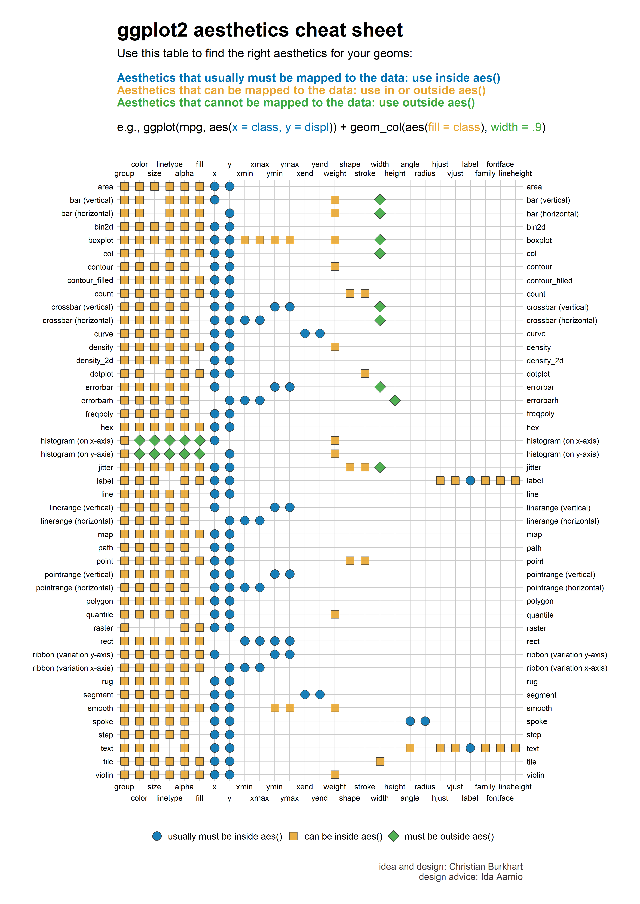
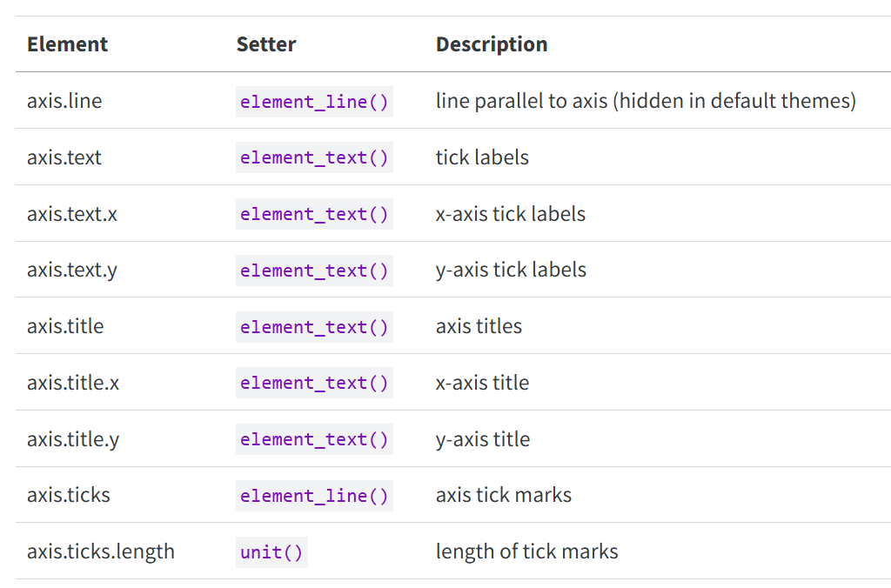
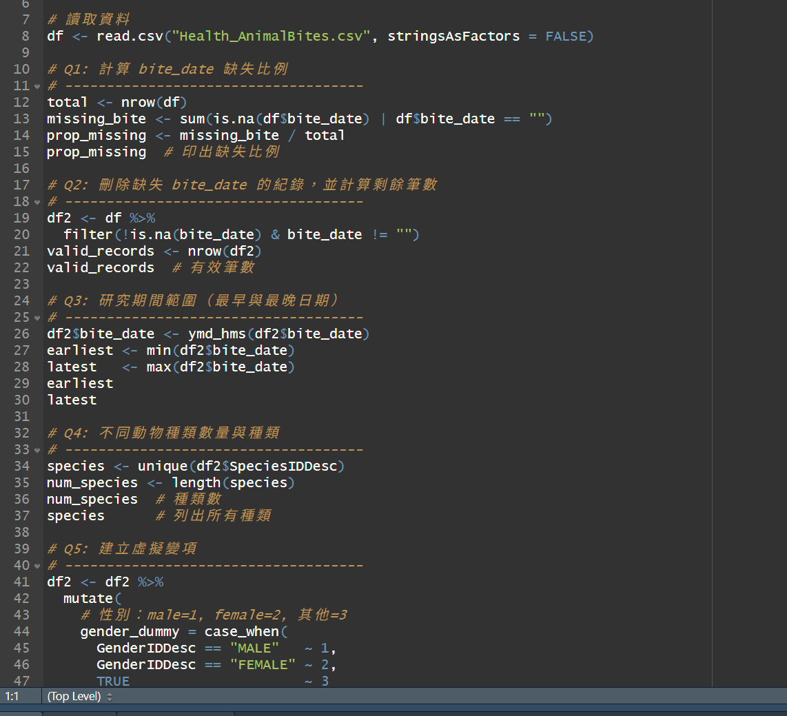
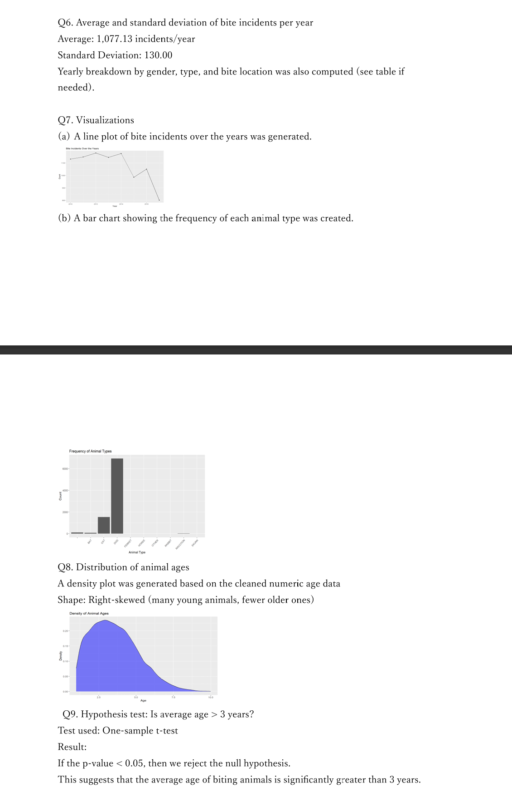

```{r}

```

layout: true
background-image: url(https://www.agec.ntu.edu.tw/uploads/asset/data/675f864c74ccc38a768f8254/%E6%9C%AA%E4%BE%86%E5%B1%95%E6%9C%9B%E5%9C%96%E7%89%87.png)
background-position: 98% 2%
background-size: 5%

```{r setup, include=FALSE}
library(knitr)
library(kableExtra)
library(dplyr)
library(ggplot2)
library(vistributions)
library(gginference)
setwd(dirname(rstudioapi::documentPath()))
options(htmltools.dir.version = FALSE)
knitr::opts_chunk$set(echo = TRUE, tidy = FALSE)
xaringanExtra::use_panelset()
xaringanExtra::use_clipboard()
xaringanExtra::use_extra_styles(hover_code_line = TRUE)
```
```{r xaringanExtra, echo = FALSE}
xaringanExtra::use_progress_bar(color = "#EFBE43", location = "bottom")
```
```{r xaringan-themer, include=FALSE, warning=FALSE}
library(xaringanthemer)
style_duo(
  # colors
  primary_color = "#FDF7E9",
  secondary_color = "#EFBE43",
  header_color = "#333333",
  text_color = "#333333",
  code_inline_color = colorspace::lighten("#333333"),
  text_bold_color = colorspace::lighten("#333333"),
  link_color = "#4466B0",
  title_slide_text_color = "#4466B0",

  # fonts
  header_font_google = google_font("Martel", "300", "400"),
  text_font_google = google_font("Lato"),
  code_font_google = google_font("Fira Mono")
)

style_extra_css(
  # 只針對段落 (p) 和列表 (li) 內的 `code`
  list(
    "p code, li code" = list(  
      "border" = "1px solid #F6DB96",
      "padding" = "2px 4px",
      "border-radius" = "4px"
      ),
    "ul ul" = list(
      "list-style-type" = "'▸'"  # 第二層使用三角形 (▸)
      ),
    "ul ul ul" = list(
      "list-style-type" = "'✔'"  # 第三層使用勾勾 (✔)
      ),
    # 置中
    ".middle_block" = list(
      "position" = "absolute",
      "top" = "50%",
      "left" = "50%", # 使與預設靠左距離相同
      "transform" = "translate(-50%, -50%)",
      "width" = "85%",              # 控制內文寬度（可調整）
      "text-align" = "left"         
      ),
    # 縮排
    ".indent" = list(
      "text-indent" = "2em"
      ),
    # 自動換行
    "pre code" = list(
      "white-space" = "pre-wrap",
      "word-wrap" = "break-word"
      ),
    "pre" = list(
      "border" = "none",
      "box-shadow" = "2px 2px 2px 2px #F7EEDA",
      "padding" = "0.1em",
      "background" = "none !important",
      "overflow-x" = "auto",
      "border-radius" = "1px"
      ),
    # 條列圖示顏色
    "li::marker" = list(
      "content" = "• ",
      "color" =  "#EFBE43"
      )
    )
  )

```


```{r, echo = FALSE}
options(servr.daemon = TRUE)
```

---
## Recall ggplot2

```{r echo = FALSE, out.width="75%", fig.align='center'}
knitr::include_graphics("./gglayers.png")
```
<p style="text-align: center;">圖片來源：<a href="https://r.qcbs.ca/workshop03/book-en/grammar-of-graphics-gg-basics.html">QCBS R Workshop</a></p>

---
## Gapminder

[Gapminder](https://www.gapminder.org/) 是一個非營利組織，統計世界各個國家長期的社會、經濟與環境等指標。在 R 中有簡易的示範資料，包含各個國家中的 GDP、平均壽命等數據。

```{r}
library(gapminder)
df <- gapminder
glimpse(df)
```

---
## Basic ggplot2
上學期有使用 **ggplot2** 快速示範過各個統計圖表，如：散點圖、折線圖或直方圖，其中各個圖表中還有許多細節可以調整與修改。

.panelset[
.panel[.panel-name[Basic]
首先，最最基礎的 ggplot object 需要有三個要素：

- 繪圖資料（Data）： 分析數據。

- 幾何圖形（Geom）： 圖表類型。

- 映射（Mapping）： 圖表上呈現的數值與樣態。
]
.panel[.panel-name[Step]
將圖層（Ｇrammar of graphics）拆開來理解：

- `ggplot()` 拿出一張白紙來畫圖

- `ggplot(data = df)` 使用 df 這個材料來畫圖

- `geom_point()` 決定畫一張散點圖

- `mapping = aes(x = gdpPercap, y = lifeExp)` 將 gdpPercap 映射在散點圖的 X 軸上、lifeExp 映射在散點圖的 Y 軸上

]
.panel[.panel-name[Code]
.pull-left[
```{r fig1, fig.show = 'hide'}
ggplot(data = df) + geom_point(mapping = aes(x = gdpPercap, y = lifeExp))
```
看起來平均 GDP 與平均壽命呈現正相關。
]
.pull-left[
```{r ref.label = 'fig1', echo = FALSE, out.width="85%", fig.align='center'}
```
]
]
]

---
## Collapse Data

如果當想要分析的資料層級與手邊的資料層級不同時，就必須將資料疊加、加總起來，如：手上的資料是日資料，而我們想要分析月層級的資料，就必須將日資料加總成月資料。

這邊我們先用 `summarize()` 來將 df 中的資料從每年各國家加總成每年各洲：
```{r}
df1 <- df %>% group_by(year, continent) %>%
  summarize(lifeExp = mean(lifeExp, na.rm = T),
            pop = mean(pop, na.rm = T),
            gdpPercap = mean(gdpPercap, na.rm = T), .groups = "keep")
```
也可以使用 `across()` 簡化寫法：

```{r}
df1 <- df %>% group_by(year, continent) %>%
  summarize(across(lifeExp:gdpPercap, mean), .groups = "keep")
```

---
## Visualize Collapsed Data
將資料變成洲級資料後可以看出更明顯的 GDP 越高平均壽命也越高的趨勢。
```{r out.width="46%", fig.align='center'}
ggplot(data = df1) + geom_point(mapping = aes(x = gdpPercap, y = lifeExp))
```

---
## Main Goal Today 

```{r echo = FALSE, out.width="50%", fig.align='center'}
knitr::include_graphics("https://edu-resource.thomasjwise.com/dataviz_research/learning_materials/images/ggplot_graphs.jpg")
```

<p style="text-align: center;">圖片來源：<a href="https://edu-resource.thomasjwise.com/dataviz_research/learning_materials/images/ggplot_graphs.jpg">hugo-theme-learn</a></p>
]

---
## Aesthetics 

.pull-left[
```{r echo = FALSE, out.width="80%", fig.align='center'}

```
<p style="text-align: center;">圖片來源：<a href="https://x.com/ChBurkhart/status/1287462411667152897">Christian Burkhart</a></p>
]
.pull-right[
在 `geom_*(mapping = aes())` 統計圖表圖層中，儘管每個統計圖表都有預設值（即輸入 X、Y 後就有東西畫出來），但還有許多設置可以客制化圖表，如：大小、樣式、顏色、透明度等屬性。

而每個統計圖表所能調整的屬性略有不同，取決於該圖表繪製時所使用的數據與方法。
[各圖表內容可參考](https://ggplot2tor.com/aesthetics/)
]

---
## Scatter Plot
.panelset[
.panel[.panel-name[Shape]
散點圖預設的圖形為實心原點（16），可以透過 `shape` 來修改點形狀。
.pull-left[
```{r fig2, fig.show = 'hide'}
ggplot(data = df1) + geom_point(mapping = aes(x = gdpPercap, y = lifeExp), shape = 17)
```
]
.pull-right[
```{r ref.label='fig2', echo = FALSE, out.width="85%", fig.align='center'}
```
]
]
.panel[.panel-name[Size]
可以透過 `size` 來修改點大小。
.pull-left[
```{r fig3, fig.show = 'hide'}
ggplot(data = df1) + geom_point(mapping = aes(x = gdpPercap, y = lifeExp), size = 3) 
```
]
.pull-right[
```{r ref.label='fig3', echo = FALSE, out.width="85%", fig.align='center'}
```
]
]

.panel[.panel-name[Color]
可以透過 `color` 來修改點顏色。
.pull-left[
```{r fig4, fig.show = 'hide'}
ggplot(data = df1) + geom_point(mapping = aes(x = gdpPercap, y = lifeExp), color = "blue") 
```
]
.pull-right[
```{r ref.label='fig4', echo = FALSE, out.width="85%", fig.align='center'}
```
]
]

]

---
## Line Plot
.panelset[
.panel[.panel-name[Type]
折線圖預設的線條樣式為實線（1），可以透過 `linetype` 來修改線條樣式。
.pull-left[
```{r fig5, fig.show = 'hide'}
ggplot(data = df1) + geom_line(mapping = aes(x = gdpPercap, y = lifeExp), linetype = 2)
```
]
.pull-right[
```{r ref.label='fig5', echo = FALSE, out.width="85%", fig.align='center'}
```
]
]

.panel[.panel-name[Width]
可以透過 `linewidth` 來修改線條寬度。
.pull-left[
```{r fig6, fig.show = 'hide'}
ggplot(data = df1) + geom_line(mapping = aes(x = gdpPercap, y = lifeExp), linewidth = 2)
```
]
.pull-right[
```{r ref.label='fig6', echo = FALSE, out.width="85%", fig.align='center'}
```
]
]

.panel[.panel-name[Transparency]
可以透過 `alpha` 來修改線條透明度。
.pull-left[
```{r fig7, fig.show = 'hide'}
ggplot(data = df1) + geom_line(mapping = aes(x = gdpPercap, y = lifeExp), linewidth = 2, alpha = 0.5)
```
]
.pull-right[
```{r ref.label='fig7', echo = FALSE, out.width="85%", fig.align='center'}
```
]
]

]

---
## Labs

說明一張圖表最重要的元素莫過於整張圖的標題、子標題或座標標題等等。

.panelset[
.panel[.panel-name[title]
.pull-left[
```{r fig8, fig.show = 'hide'}
ggplot(data = df1) + geom_point(mapping = aes(x = gdpPercap, y = lifeExp), size = 3) +
  ggtitle("GDP per capita vs. Life expectancy")
```
]
.pull-right[
```{r ref.label='fig8', echo = FALSE, out.width="85%", fig.align='center'}
```
]
]
.panel[.panel-name[xlab]
.pull-left[
```{r fig9, fig.show = 'hide'}
ggplot(data = df1) + geom_point(mapping = aes(x = gdpPercap, y = lifeExp), size = 3) +
  ggtitle("GDP per capita vs. Life expectancy") +
  xlab("GDP per capita(US$)")
```
]
.pull-right[
```{r ref.label='fig9', echo = FALSE, out.width="85%", fig.align='center'}
```
]
]
.panel[.panel-name[ylab]
.pull-left[
```{r fig10, fig.show = 'hide'}
ggplot(data = df1) + geom_point(mapping = aes(x = gdpPercap, y = lifeExp), size = 3) +
  ggtitle("GDP per capita vs. Life expectancy") +
  xlab("GDP per capita (US$)") + 
  ylab(NULL)
```
]
.pull-right[
```{r ref.label='fig10', echo = FALSE, out.width="85%", fig.align='center'}
```
]
]
.panel[.panel-name[labs]
可以使用 `labs` 一次完成 title, x ,y 標題設置。
.pull-left[
```{r fig11, fig.show = 'hide'}
ggplot(data = df1) + geom_point(mapping = aes(x = gdpPercap, y = lifeExp), size = 3) +
  labs(title = "GDP per capita vs. Life expectancy", x = "GDP per capita (US$)", y = "Life expectancy (years)")
```
]
.pull-right[
```{r ref.label='fig11', echo = FALSE, out.width="85%", fig.align='center'}
```
]
]

]

---
## Theme
預設的圖表中，各個元素總是有美中不足的部分，這時就可以透過 ggplot 中的現成主題如：`theme_minimal()` 更換主題或是手動使用 `theme()` 將整張圖表的各細節進行調整。

.panelset[
.panel[.panel-name[theme_minimal]
```{r echo = FALSE, out.width="40%", fig.align='center'}
ggplot(data = df1) + geom_point(mapping = aes(x = gdpPercap, y = lifeExp), size = 3) +
  labs(title = "GDP per capita vs. Life expectancy", xlab = "GDP per capita (US$)", ylab = "Life expectancy (years)") +
  theme_minimal()
```
]
.panel[.panel-name[theme_void]
```{r echo = FALSE, out.width="40%", fig.align='center'}
ggplot(data = df1) + geom_point(mapping = aes(x = gdpPercap, y = lifeExp), size = 3) +
  labs(title = "GDP per capita vs. Life expectancy", xlab = "GDP per capita (US$)", ylab = "Life expectancy (years)") +
  theme_void()
```
]
.panel[.panel-name[theme_bw]
```{r echo = FALSE, out.width="40%", fig.align='center'}
ggplot(data = df1) + geom_point(mapping = aes(x = gdpPercap, y = lifeExp), size = 3) +
  labs(title = "GDP per capita vs. Life expectancy", xlab = "GDP per capita (US$)", ylab = "Life expectancy (years)") +
  theme_bw()
```
]
.panel[.panel-name[theme_gray]
```{r echo = FALSE, out.width="40%", fig.align='center'}
ggplot(data = df1) + geom_point(mapping = aes(x = gdpPercap, y = lifeExp), size = 3) +
  labs(title = "GDP per capita vs. Life expectancy", xlab = "GDP per capita (US$)", ylab = "Life expectancy (years)") +
  theme_gray()
```
]
]

---
## Theme
`theme()` 可以手動調整更多細節部分，包括：字體大小、位置、顏色，基本寫法為 `theme(element.name = element_function())`。

延續 ggplot2 的圖層邏輯，允許基於一個已存在的 ggplot 物件進行 theme 上的修改。

.pull-left[
```{r fig12, fig.show = 'hide'}
raw <- ggplot(data = df1) + geom_point(mapping = aes(x = gdpPercap, y = lifeExp), size = 3) 
p <- raw + labs(title = "GDP per capita vs. Life expectancy", x = "GDP per capita (US$)", y = "Life expectancy (years)")

print(p)
```
]
.pull-right[
```{r ref.label='fig12', echo = FALSE, out.width="95%", fig.align='center'}
```
]
---
## Theme
.panelset[
.panel[.panel-name[title size]
```{r out.width="45%", fig.align='center'}
p + theme(plot.title = element_text(size = 30))
```
]
.panel[.panel-name[title color]
```{r out.width="45%", fig.align='center'}
p + theme(plot.title = element_text(colour = "red"))
```
]
.panel[.panel-name[title position]
```{r out.width="45%", fig.align='center'}
p + theme(plot.title = element_text(hjust = 0.5))
```
]
.panel[.panel-name[axis text]
```{r out.width="45%", fig.align='center'}
p + theme(axis.text = element_text(size = 15))
```
]

.panel[.panel-name[more axis appearances]
```{r echo = FALSE, out.width="70%", fig.align='center'}

```
<p style="text-align: center;">圖片來源：<a https://ggplot2-book.org/themes">ggplot2 book</a></p>
]
]

---
## Correlation
使用 `geom_smooth()` 來展現兩個變數之間的線性關係。
```{r out.width="40%", fig.align='center'}
ggplot(data = df1) + geom_smooth(mapping = aes(x = gdpPercap, y = lifeExp))
```

---
## Correlation
可以使用 `method` 決定兩變數間擬合線的模型。
```{r out.width="40%", fig.align='center', message=FALSE}
ggplot(data = df1) + geom_smooth(mapping = aes(x = gdpPercap, y = lifeExp), method = "lm")
```
---
## Correlation
疊加圖表能初步判斷擬合線的模型估計是否有誤差或受極值影響。
.pull-left[
```{r echo=F, fig.align='center', message=FALSE}
p + geom_smooth(mapping = aes(x = gdpPercap, y = lifeExp), color = 'navy')
```
]
.pull-right[
```{r echo=F, fig.align='center', message=FALSE}
p + geom_smooth(mapping = aes(x = gdpPercap, y = lifeExp), method = "lm")
```
]
---
## Straight Line
在圖形上添加直線以強調某個統計重要數值或時間點。
.panelset[
.panel[.panel-name[Horizontal]
.pull-left[
```{r fig13, fig.show = 'hide', message=FALSE}
p + geom_smooth(mapping = aes(x = gdpPercap, y = lifeExp)) + geom_hline(aes(yintercept = mean(lifeExp), color = "red"))
```
]
.pull-right[
```{r ref.label='fig13', echo = FALSE, out.width="95%", fig.align='center', message=FALSE}
```
]
]

.panel[.panel-name[Vertical]
.pull-left[
```{r fig14, fig.show = 'hide', message=FALSE}
p + geom_smooth(mapping = aes(x = gdpPercap, y = lifeExp)) + geom_vline(aes(xintercept = median(gdpPercap), color = "red"))
```
]
.pull-right[
```{r ref.label='fig14', echo = FALSE, out.width="95%", fig.align='center', message=FALSE}
```
]
]
]

---
## Mapping Error
不管在疊加圖層或是修改圖層元素時，要注意 Mapping 時繪圖指令所參考的依據。
.panelset[
.panel[.panel-name[Error]
```{r out.width="50%", fig.align='center', error=TRUE}
p + geom_smooth(mapping = aes(x = gdpPercap, y = lifeExp)) + geom_vline(xintercept = median(gdpPercap), color = "red")
```
]
.panel[.panel-name[Global]
```{r out.width="35%", fig.align='center', message=FALSE}
p + geom_smooth(mapping = aes(x = gdpPercap, y = lifeExp)) + geom_vline(xintercept = median(df1$gdpPercap), color = "red")
```
]
.panel[.panel-name[Local]
** 放在 `aes()` 中的元素才屬於一開始 ggplot 物件 p 中的資料範圍內。**
```{r out.width="30%", fig.align='center', message=FALSE}
p + geom_smooth(mapping = aes(x = gdpPercap, y = lifeExp)) + geom_vline(aes(xintercept = median(gdpPercap), color = "red"))
```
]
]

---
## HW1 說明
#### HW1 繳交方式：
- **於 NTU COOL 線上繳交。**

- **以壓縮檔繳交作業，命名方式：學號_hw1.zip / rar / 7z。**

- **壓縮檔須包含：學號_hw1.R、學號_hw1_report.pdf。**
  

#### HW1 繳交期限：
- **2025-09-30 23:59**

- **實習課作業遲交 24 小時內扣 10 分，超過時間則視為 0 分。**

---
## HW code sample
```{r echo = FALSE, out.width="75%", fig.align='center'}

```

---
## HW report sample
```{r echo = FALSE, out.width="40%", fig.align='center'}

```
---
class: center, middle, inverse
### 謝謝
#### 下周見


